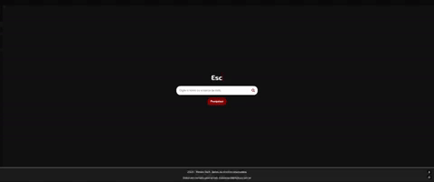

    <h1>Motos Tech</h1>
    

<h2>Projeto da Imersão Dev com Google Gemini - Alura</h2>

Uma <a href="https://motos-tech.vercel.app/">Landing Page</a> de busca. Você pode digitar o nome de uma moto ou marca e aparecerá as informações referente a sua pesquisa.

Atualmente a base da dados só possui 4 motos, sendo elas: Hunter 350, FZ15 ABS, CG TITAN 160 e MT03.

