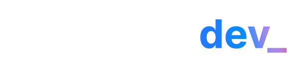

<h1>Um projeto básico front-end usando HTML, CSS e JS</h1>
<p class="size">Projeto da Imersão Dev com Google Gemini - Alura<p>
<p>Uma landing page de busca. Você pode digitar o nome de uma moto ou marca e aparecerá as informações referente a sua pesquisa.</p>

<div class="header">
    <h1>Motos Tech</h1>
    
</div>

```css
.header {
    display: flex;
    justify-content: space-between;
    align-items: center;
}

.size {
  font-size: 16px;
}
```css
